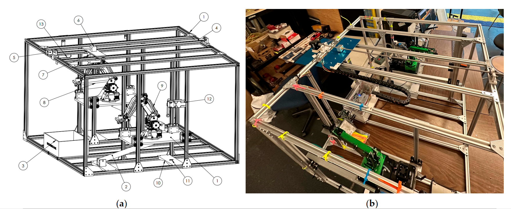

# A ROS-based framework for automated industrial painting system


<p>
Paint application is vital for product durability and aesthetics, whether done manually or by precise robotic systems. Manual work is error-prone and risky, while robots offer accuracy. However, programming robot trajectories for diverse products is challenging. Therefore, developing an autonomous system capable of generating automated paint trajectories is desirable. While adequate work has been done to optimize paint trajectories for coating thickness on complex free-form surfaces, the investigation of robot energy consumption and process time in the context of painting is left unattended. Thus, this study focuses on formulation of a hybrid optimization scheme to generate time and energy-efficient paint trajectories while ensuring optimal coating deposition on a surface. Moreover, considerable effort is put into the development of hardware and software for the integrated robotic system. Results for the trajectory optimization of a car door, hood, and bumper reveal efficient paint trajectories can be obtained using the proposed optimization scheme.
</p>


## System Functionalities
<p>This ROS repository automates the painting process. It has the following functionalities</p>
<ul>
  <li>Performs 3D scanning using an Intel RealSense D435 Sensor</li>
  <li>Calibrates the CAD model in Camera frame using the 3D scan</li>
  <li>Visualizes the 3D scan and the calibrated CAD</li>
  <li>Optimally plans the trajectory using a novel Hybrid Genetic Optimization Algorithm</li>
  <li>Visualizes the generated trajectory on the surface of the object</li>
  <li>Dispatches the trajectory points to the JetMax robots using rosbridge websockets</li>
  <Li>Computes the energy consumption in real time</Li>
  <li>Generates the results including coating thickness, energy consumption, and process time of the trajectory</li>
</ul>

## Required Hardware
<ul>
  <li>One Intel RealSense D435</li>
  <li>One Servo Motor</li>
  <li>One Stepper Motor</li>
  <li>Two Linear Actuators</li>
  <li>Two JetMax JetsonNano Robots</li>
  <li>Four VL53L0X single-point sensors</li>
  <li>Two current sensors</li>
  <li>Raspberry Pi 4 Controller</li>
  <li>Arduino UNO</li>
</ul>

## CAD Diagram
</img>

## Circuit Diagram
</img>

## Framework
</img>


## How to run?

### System Requirements

<ul>
  <li>Ubuntu 20.04</li>
  <li>ROS Noetic</li>
  <li>Python 3.8+</li>
</ul>


### Install Python3 Libraries
```
python3.exe -m pip install open3d
python3.exe -m pip install numpy
python3.exe -m pip install pandas
python3.exe -m pip install pygad
python3.exe -m pip install pickle
python3.exe -m pip install opencv-python
python3.exe -m pip install scikit-learn
python3.exe -m pip install matplotlib
python3.exe -m pip install seaborn
```
### Required ROS packages
<ul>
  <li>rosbridge <a href="https://github.com/RobotWebTools/rosbridge_suite/tree/ros1">(GitHub Link)</a></li>
  <li>async_web_server_cpp <a href="https://github.com/fkie/async_web_server_cpp/tree/ros1-releases">(GitHub Link)</a></li>
  <li>web_video_server <a href="https://github.com/RobotWebTools/web_video_server/tree/master">(GitHub Link)</a></li>
  <li>rosserial <a href="https://github.com/ros-drivers/rosserial">(GitHub Link)</a></li> 
  <li>realsense2_camera <a href="https://github.com/IntelRealSense/realsense-ros/tree/ros1-legacy">(GitHub Link)</a></li>
</ul>


### Install the repository in catkin_ws 
```
~/catkin_ws$ catkin_make
```
### Run the following commands in terminal:
```
roscore
roslaunch irsip main_v5.launch
firefox ~/catkin_ws/src/irsip/src/web_v2/index.html
```

## Graphical User Interface
<p>After running the commands, the following window should appear</p>
</img>

### License Info
```json
{"author": "Muhammad Idrees",
"email": "idreeskhan3647@gmail.com",
"Institute": "University of Ontario Institute of Technology",
"Paper": "ARSIP: Automated Robotic System for Industrial Painting",
"doi": "https://doi.org/10.3390/technologies12020027",
"thesis": "https://hdl.handle.net/10155/1718"}
```
